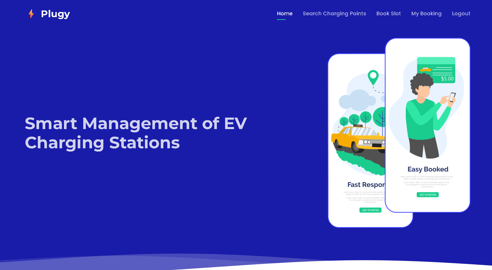

<div align="center">



  <br />

# ⚡ Plugy (SMEVCS)

**Smart Management of EV Charging Stations**


_A robust, scalable platform developed under Enthusiastic Collage Days to facilitate real-time electric vehicle (EV) charging slot discovery, dynamic pricing, advanced time-window reservations, and digital tax invoice generation._

</div>

<br />

## ✨ Key Features

- **📍 Real-Time Slot Discovery:** Filter available charging bays dynamically by geographic area, port compatibility, and charger types.
- **💰 Dynamic Pricing Engine:** Calculates base rates by factoring in vehicle type (**2-wheeler, 4-wheeler Normal AC, Fast DC**), duration, and specialized port discounts (e.g., 10% reduction for GB/T connectors), while seamlessly appending an **18% GST** calculation in real-time.
- **📅 Advanced Time-Window Reservations:** Book available slots immediately or schedule reservations in advance, visually organizing locations by city and area.
- **🧾 Digital Tax Invoices & History:** Generate print-ready receipts, securely view booking history, and manage current reservations without full-page reloads.
- **⚙️ Admin Dashboard:** Centralized infrastructure control to manage charging slots, monitor physical bays, and view comprehensive booking and payment histories.

---

## 🏗️ System Architecture & Tech Stack

Plugy operates on a monolithic **Model-View-Controller (MVC)** architecture, optimizing direct server-side rendering combined with dynamic client-side scripting for a highly responsive user experience.

### ⚙️ Backend Infrastructure

- **Application Layer:**  Pure Java MVC backend ensuring tight coupling with the Java ecosystem for rapid, secure page delivery.
- **Hosting:**  Hosted on Apache Tomcat (v9.0.74), providing a robust Java Servlet container for processing backend requests.
- **Data Persistence:**  Heavily normalized relational database utilizing standard JDBC (`com.connection.DBConnection`).
- **State Management:** User context is maintained globally via HTTP Session tracking, fortified by URL parameter fallbacks to prevent session-loss.

### 🎨 Frontend Engineering

The client-side interface relies heavily on modular JSP includes (`nav_user.jsp`, `footer_user.jsp`) to maintain structural DRY principles.

- **Presentation:**  Responsive grid layouts, interactive modals for secure DOM data injection, and modern navigation tabs.
- **Dynamic Engine:**  Powers the computational pricing engine in `Search.jsp` and manages cross-device compatibility.
- **Print & Media:** Clean, semantic markup with targeted `@media print` queries for rendering physical tax invoices.
- **Enhancements:** SVG hero waves, Animate On Scroll (AOS) library, and Remix Icons for intuitive visual hierarchy.

---

## 🗄️ Database Schema

The database relies on strict foreign key relationships and is built for horizontal scalability to separate transient transactional data from static infrastructure maps:

| 🗂️ Table      | 🎯 Core Function                                                            |
| :------------ | :-------------------------------------------------------------------------- |
| `tbl_admin`   | Manages backend administrator credentials and session logic.                |
| `tbl_user`    | Stores user metadata, encrypted passwords, and specific vehicle details.    |
| `tbl_station` | Defines physical infrastructure and macro-level localized addressing.       |
| `tbl_slot`    | Tracks individual bays, hardware port parameters, and real-time statuses.   |
| `tbl_payment` | The central transactional ledger capturing financial events and scheduling. |
| `tbl_booking` | Active slot reservations aggregated for localized user dashboard querying.  |
| `tbl_chat`    | Automated queries and answers driving the integrated smart chatbot.         |

---

## 🚀 Getting Started

### 📋 Prerequisites

Ensure you have the following environments installed on your local machine:

- 
- 
- 

### 📥 Step 0: Download Archive

Download the attached `.war` & `.sql` file from the **Assets** section of the Git release.

---

### ⚙️ Eclipse IDE Setup

**Step 1: Import the Project**

1. In Project Explorer Click **File** → **Import...**
2. Expand the **Web** folder.
3. Select **WAR file** and click **Next**.
4. Click **Browse...** to select your `.war` file.
5. Set your web project name and click **Finish**.

**Step 2: Open the Servers View**

1. Go to the top menu: **Window** → **Show View** → **Servers**.
   _(If not listed there, click **Other...**, expand **Server**, select **Servers**, and click **Open**)._
2. Look at the bottom panel where the **Servers** tab appeared.

**Step 3: Reconfigure Apache Tomcat**

1. In the **Servers** tab, click the blue link: _No servers are available. Click this link to create a new server..._
2. In the wizard, expand the **Apache** folder.
3. Select your Tomcat version (e.g., **Tomcat v9.0** or **Tomcat v10.1**). Click **Next**.
4. Next to **Tomcat installation directory**, click **Browse...** and select the folder where Tomcat is installed.
5. Click **Finish**.

**Step 4: Add the Project to the Server**

1. In the **Servers** tab, right-click the server you just created.
2. Select **Add and Remove...**
3. Select your project in the **Available** box on the left, click **Add >** to move it to the **Configured** box on the right.
4. Click **Finish**.

**Step 5: Verify the Database Code**
Make sure the database connection file retained the working configuration:

1. In **Project Explorer**, expand the project → `src` → package `com.connection` → open `DBConnection.java`.
2. Ensure the following credentials match your local database:
   ```java
   DBName = "smevcs";
   DBUSER = "root";
   DBPASSWORD = "";
   ```
   import `smevcs.sql` inside db.
3. Also check inside `WebContent/WEB-INF/lib` (or `src/main/webapp/WEB-INF/lib`) to confirm your **MySQL Connector JAR** (`mysql-connector-*.jar`) is present.

**Step 6: Start and Run**

1. Ensure **MySQL** is actively running in your XAMPP/MAMP Control Panel.
2. In Eclipse's **Servers** tab, right-click the server and click **Start**.
3. Open your browser and navigate to your application URL:
   ```text
   http://localhost:8080/SMEVCS/
   ```
